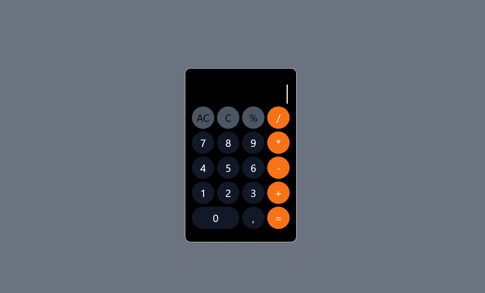

# Calculadora Orientada a Objetos
Projeto feito para a prática de programação orientada a objetos, com a finalidade de escrever códigos organizados e reutilizáveis.

### Descrição do projeto:
Este projeto consiste em uma calculadora básica que oferece funcionalidades padrões, como adição, subtração, multiplicação e divisão, assim também como a capacidade de limpar a tela e apagar o último dígito. Foram utilizados métodos para verificação de processos, que verificam se a calculadora já fez uma operação antes de adicionar mais digitos, regex para separar operadores aritiméticos de números, e a possibilidade de realizar expressões numéricas respeitando a ordem de precedência dos operadores.

 ### Tecnologias utilizadas:

 - Html
 - Tailwindcss
 - Javascript

 ### Veja o site aqui:
https://pabloquirino.github.io/POO-calculadora/src/

### Captura de tela:
  

